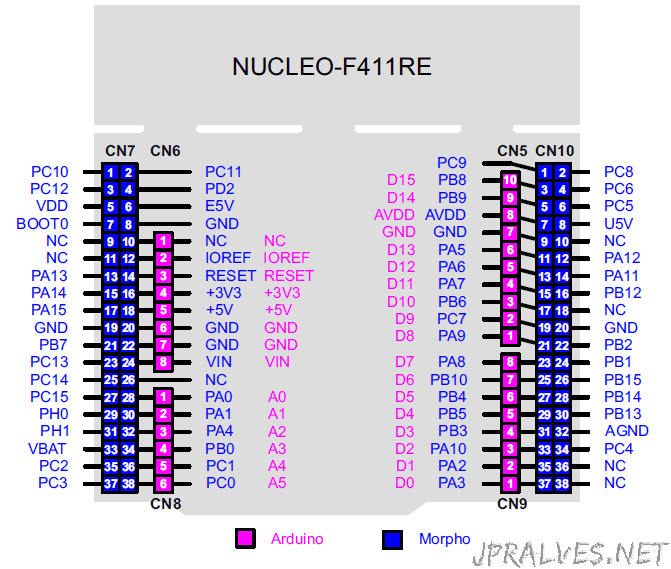
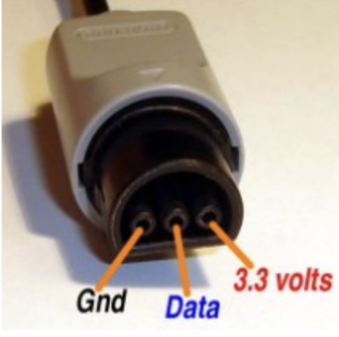

# README
(WIP) Rust embedded-hal driver for the Nintendo 64 (N64) controller (NUS-005) 

**MAKE SURE TO UPDATE**

Make sure to update `rust-toolchain.toml` to match the version found here: https://github.com/embassy-rs/embassy/blob/main/rust-toolchain.toml

## Getting started

Follow guide here: https://embassy.dev/book/dev/getting_started.html

## Running 

plug in the dev board and just run:
```bash
cargo run
```

## Devboard Pinout


## Controller Pinout


## References

- https://inst.eecs.berkeley.edu/~cs150/fa04/Lab/Checkpoint1.PDF
- https://www.eecs.umich.edu/courses/eecs373.f16/Lec/StudentTalks/N64.pdf
- https://os.mbed.com/users/fomartin/notebook/n64-controller-interface/
- https://www.qwertymodo.com/hardware-projects/n64/n64-controller
- https://kthompson.gitlab.io/2016/07/26/n64-controller-protocol.html